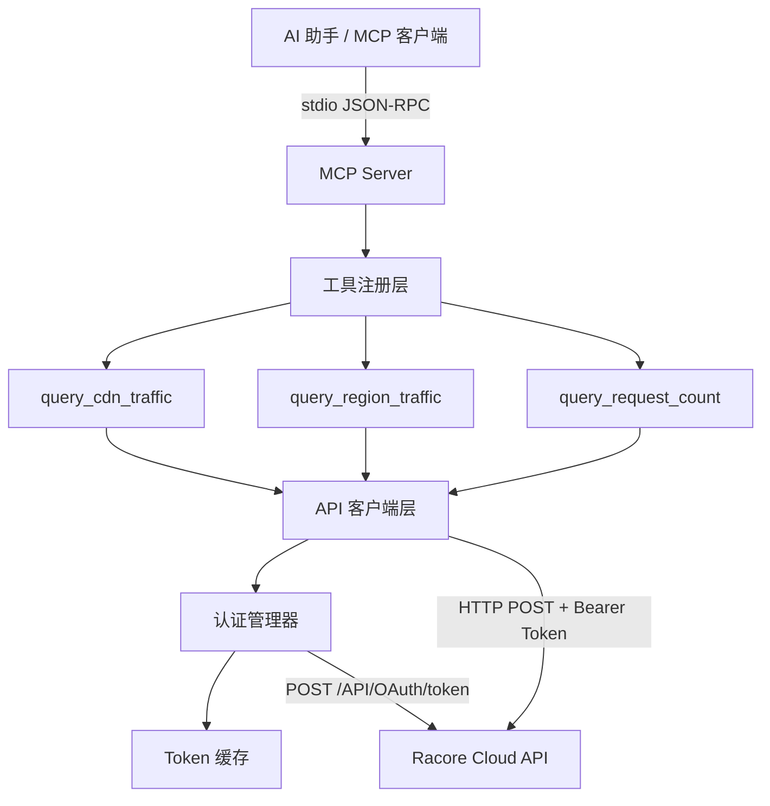
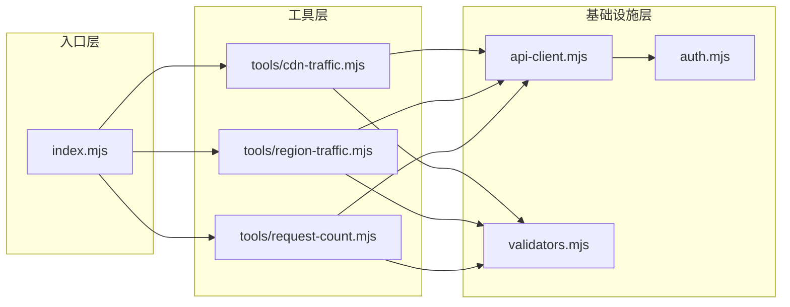

# 设计文档

## 概述

本设计文档描述 Racore Cloud CDN MCP Server 的技术实现方案。该服务以 Node.js ES Module (.mjs) 项目形式实现，通过 MCP 协议的 stdio 传输方式向 AI 助手暴露三个 CDN 统计查询工具。

核心设计目标：
- **简洁性**：使用 Node.js 内置能力（crypto、fetch），最小化外部依赖
- **可靠性**：完善的 Token 缓存与自动刷新机制，网络错误重试
- **标准化**：严格遵循 MCP SDK 的 Server/Transport 模式和工具注册规范

### 研究发现

通过对 MCP SDK 文档和社区实践的研究，确认以下关键技术选择：
- `@modelcontextprotocol/sdk` 提供 `McpServer` 类和 `StdioServerTransport` 用于 stdio 通信
- 工具通过 `server.tool()` 方法注册，参数使用 Zod schema 定义
- 所有工具返回 `{ content: [...] }` 格式，错误通过 `isError: true` 标志
- Node.js 18+ 内置 `fetch` API 和 `crypto` 模块满足所有网络和加密需求

## 架构

### 高层架构



### 模块划分



### 设计决策

| 决策 | 选择 | 理由 |
|------|------|------|
| 项目结构 | 扁平模块结构 | 项目规模小，无需深层嵌套，便于维护 |
| HTTP 客户端 | Node.js 内置 fetch | 符合需求约束，无需额外依赖 |
| 签名算法 | Node.js crypto | 内置模块，支持 HMAC-SHA512 |
| 参数校验 | Zod schema | MCP SDK 原生支持，类型安全 |
| Token 管理 | 内存缓存 + 提前刷新 | 进程级单例，适合 stdio 模式的长连接 |
| 错误传递 | MCP isError 标志 | 标准 MCP 错误响应方式 |

## 组件与接口

### 1. 入口模块 (index.mjs)

**职责**：初始化 MCP Server，校验环境变量，注册工具，启动 stdio 传输。

```javascript
// 接口定义
export async function main(): Promise<void>
```

**启动流程**：
1. 读取并校验环境变量 `RACORE_ACCESS_KEY` 和 `RACORE_SECRET_KEY`
2. 创建 `McpServer` 实例（名称: "racore-cdn-mcp-server"，版本: "1.0.0"）
3. 注册三个工具及其 Zod schema
4. 创建 `StdioServerTransport` 并连接

### 2. 认证管理器 (auth.mjs)

**职责**：管理 Racore API 认证流程，维护 Token 缓存。

```javascript
// 导出接口
export function createAuthManager(accessKey: string, secretKey: string): AuthManager

interface AuthManager {
  getValidToken(): Promise<string>  // 获取有效 Token，自动处理刷新
}

// 内部状态
interface TokenCache {
  token: string       // Bearer Token 值
  expire: number      // 过期时间 Unix 时间戳（秒）
}
```

**签名计算流程**：
1. 生成 RFC1123 格式时间戳：`new Date().toUTCString()`
2. 拼接签名原文：`x_request_date + access_key + secret_key`
3. HMAC-SHA512 计算：`crypto.createHmac('sha512', secretKey).update(message).digest('hex')`

**Token 刷新策略**：
- 缓存为空 → 执行认证
- 距离过期不足 5 分钟 → 提前刷新
- Token 有效 → 直接返回缓存值

### 3. API 客户端 (api-client.mjs)

**职责**：封装 Racore API 的 HTTP 调用逻辑，处理通用请求/响应。

```javascript
// 导出接口
export function createApiClient(authManager: AuthManager): ApiClient

interface ApiClient {
  post(endpoint: string, body: object): Promise<ApiResponse>
}

interface ApiResponse {
  code: number
  message: string
  data: any
}
```

**请求流程**：
1. 通过 `authManager.getValidToken()` 获取 Token
2. 发送 POST 请求（30 秒超时，`AbortController`）
3. 解析 JSON 响应
4. 如果 HTTP 401 → 清除缓存，重新认证，重试一次
5. 返回结构化响应或抛出错误

### 4. 参数校验器 (validators.mjs)

**职责**：校验工具输入参数的业务规则。

```javascript
// 导出接口
export function validateTimeParams(params: {
  start_time?: string,
  end_time?: string,
  scope?: string
}): { valid: true, query: object } | { valid: false, error: string }

export function validateTimeFormat(timeStr: string): boolean
export function validateTimeRange(startTime: string, endTime: string): boolean  // ≤ 90 天
```

**校验规则**：
- `start_time` / `end_time` 格式：`yyyy-mm-dd hh:mm`
- `scope` 枚举：`today | yesterday | week | month | last_month`
- 互斥：不能同时提供 `start_time/end_time` 和 `scope`
- 成对：`start_time` 和 `end_time` 必须同时提供
- 范围：时间跨度不超过 90 天（仅 query_cdn_traffic）
- 默认：均未提供时，默认 `scope = "today"`

### 5. 工具实现模块

每个工具模块的统一接口模式：

```javascript
// tools/cdn-traffic.mjs
export function registerCdnTrafficTool(server: McpServer, apiClient: ApiClient): void

// tools/region-traffic.mjs
export function registerRegionTrafficTool(server: McpServer, apiClient: ApiClient): void

// tools/request-count.mjs
export function registerRequestCountTool(server: McpServer, apiClient: ApiClient): void
```

每个注册函数内部：
1. 定义 Zod 参数 schema
2. 调用 `server.tool(name, description, schema, handler)`
3. handler 内执行参数校验 → API 调用 → 结果格式化

## 数据模型

### API 请求/响应模型

```javascript
// OAuth 认证请求
interface AuthRequest {
  access_key: string    // 公开密钥标识符
  signature: string     // HMAC-SHA512 签名（小写十六进制）
}

// OAuth 认证响应
interface AuthResponse {
  code: number          // 1 = 成功
  message: string
  data: {
    token: string       // Bearer Token
    expire: number      // 过期时间（Unix 时间戳，秒）
  }
}

// CDN 流量查询请求参数
interface CdnTrafficParams {
  domain?: string       // 域名（多个以逗号分隔）
  start_time?: string   // 格式: yyyy-mm-dd hh:mm
  end_time?: string     // 格式: yyyy-mm-dd hh:mm
  scope?: string        // today|yesterday|week|month|last_month
}

// CDN 流量查询响应
interface CdnTrafficResponse {
  code: number
  message: string
  data: Array<{
    timestamp: string   // Unix 时间戳字符串
    flow: string        // 流量值（字节数字符串）
  }>
}

// 地区流量查询响应
interface RegionTrafficResponse {
  code: number
  message: string
  data: Array<{
    region: string      // 地区代码
    req: number         // 请求数
    req_ratio: string   // 请求占比百分比
    flow: number        // 流量字节数
    flow_ratio: string  // 流量占比百分比
  }>
  country_codes?: Array<{
    code: string        // 国家代码
    zh: string          // 中文名称
    en: string          // 英文名称
  }>
}

// 请求数查询响应
interface RequestCountResponse {
  code: number
  message: string
  data: Array<{
    timestamp: string   // Unix 时间戳字符串
    count: number       // 请求计数值（5 分钟间隔）
  }>
}
```

### MCP 工具返回模型

```javascript
// 成功返回
{
  content: [{ type: "text", text: JSON.stringify(formattedData) }]
}

// 错误返回
{
  content: [{ type: "text", text: "错误描述信息" }],
  isError: true
}
```

### 文件结构

```
racorecloud-mcp/
├── package.json          # type: "module", engines: ">=18.0.0"
├── index.mjs             # 入口：初始化 Server、校验环境变量、注册工具
├── auth.mjs              # 认证管理器：签名计算、Token 缓存与刷新
├── api-client.mjs        # API 客户端：HTTP 请求封装、超时、重试
├── validators.mjs        # 参数校验：时间格式、互斥检查、范围验证
└── tools/
    ├── cdn-traffic.mjs   # query_cdn_traffic 工具实现
    ├── region-traffic.mjs # query_region_traffic 工具实现
    └── request-count.mjs  # query_request_count 工具实现
```

## 正确性属性

*属性（Property）是系统在所有合法执行中应保持为真的特征或行为——本质上是对系统应做之事的形式化陈述。属性是人类可读规格与机器可验证正确性保证之间的桥梁。*

### 属性 1: 签名计算的确定性与格式

*对于任意* access_key、secret_key 和日期字符串的组合，HMAC-SHA512 签名计算应始终产生一个 128 字符的小写十六进制字符串，且相同输入始终产生相同输出。

**验证: 需求 2.3**

### 属性 2: Token 刷新决策正确性

*对于任意*缓存的 Token（含 expire 时间戳）和当前时间，当且仅当 (expire - 当前时间) < 300 秒时，系统应触发 Token 刷新流程。

**验证: 需求 2.6**

### 属性 3: 时间参数与 scope 互斥校验

*对于任意*有效的 start_time/end_time 组合和有效的 scope 值，当两者同时提供时，所有三个工具均应拒绝请求并返回参数冲突错误。

**验证: 需求 3.3, 4.3, 5.3**

### 属性 4: 时间参数成对校验

*对于任意*有效的时间字符串，如果仅提供 start_time 而不提供 end_time（或反之），query_region_traffic 和 query_request_count 工具应返回参数错误。

**验证: 需求 4.4, 5.7**

### 属性 5: 时间跨度 90 天上限校验

*对于任意*一对有效的 start_time 和 end_time，当两者的时间差超过 90 天时，query_cdn_traffic 工具应返回参数校验错误。

**验证: 需求 3.7**

### 属性 6: 时间格式校验

*对于任意*不符合 `yyyy-mm-dd hh:mm` 格式的字符串（包含无效日期组件），参数校验器应拒绝该输入并指明无效的参数名称及期望格式。

**验证: 需求 7.3**

### 属性 7: CDN 流量响应数据保留

*对于任意*有效的 API 成功响应（包含时间戳和流量值数组），query_cdn_traffic 工具输出应包含所有原始记录，每条记录的时间戳和流量值与 API 响应完全一致。

**验证: 需求 3.5**

### 属性 8: 地区流量响应完整性

*对于任意*有效的地区流量 API 成功响应，工具输出应包含所有 region、req、req_ratio、flow、flow_ratio 字段；若响应中 country_codes 数组非空，输出还应包含完整的国家代码映射（code、zh、en）。

**验证: 需求 4.6, 4.7**

### 属性 9: 请求数响应数据保留

*对于任意*有效的 API 成功响应（包含时间戳和请求数数组），query_request_count 工具输出应包含所有原始记录，时间戳和请求数与 API 响应一致。

**验证: 需求 5.5**

### 属性 10: 错误响应统一标志

*对于任意*错误条件（参数校验失败、API 错误、网络错误、认证失败），工具响应必须包含 `isError: true` 标志且 content 为人类可读的文本描述。

**验证: 需求 7.6**

## 错误处理

### 错误分类与处理策略

| 错误类型 | 触发条件 | 处理方式 |
|----------|----------|----------|
| 环境变量缺失 | 启动时 key 未设置/空 | stderr 输出 + 非零退出码 |
| 参数校验错误 | 格式错误/互斥/超范围 | isError 返回，指明具体参数问题 |
| 认证失败 | OAuth 返回 code≠1 | isError 返回，包含 API message |
| 网络超时 | 30 秒无响应 | isError 返回，说明超时和目标端点 |
| 连接失败 | DNS/TCP 错误 | isError 返回，包含连接失败原因 |
| JSON 解析失败 | 响应非 JSON | isError 返回，包含 HTTP 状态码 |
| 401 未授权 | Token 过期/无效 | 清除缓存 → 重新认证 → 重试一次 |
| 重试后仍 401 | 凭据无效 | isError 返回认证失败描述 |
| API 业务错误 | code≠1 | isError 返回 API message |

### 错误响应格式

所有工具错误通过 MCP SDK 的标准错误格式返回：

```javascript
{
  content: [{ type: "text", text: "具体的错误描述信息" }],
  isError: true
}
```

### 重试策略

- **范围**：仅对 HTTP 401 状态码执行重试
- **次数**：最多重试 1 次
- **流程**：清除 Token 缓存 → 重新认证 → 使用新 Token 重发原请求
- **终止**：重试后仍失败则返回最终错误，不再继续

### 超时控制

- 所有 HTTP 请求（认证 + API 调用）使用 30 秒超时
- 通过 `AbortController` + `setTimeout` 实现
- 超时后立即终止请求并返回错误

## 测试策略

### 测试框架选择

- **单元测试 + 属性测试**：使用 [Vitest](https://vitest.dev/) 作为测试运行器
- **属性测试库**：使用 [fast-check](https://github.com/dubzzz/fast-check) 实现属性测试
- **Mock**：使用 Vitest 内置 mock 能力模拟 fetch 和环境变量

### 双重测试方法

#### 属性测试（Property-Based Tests）

验证系统在所有合法输入下的普遍正确性：

- 每个属性测试运行最少 100 次迭代
- 使用 fast-check 生成随机输入
- 每个测试标注对应的设计属性
- 标注格式：**Feature: racore-cdn-mcp-server, Property {number}: {property_text}**

**覆盖范围**：
- 签名计算的格式和确定性（属性 1）
- Token 刷新决策逻辑（属性 2）
- 参数互斥校验（属性 3）
- 时间参数成对校验（属性 4）
- 90 天范围校验（属性 5）
- 时间格式校验（属性 6）
- 响应数据保留（属性 7、8、9）
- 错误标志统一性（属性 10）

#### 单元测试（Example-Based Tests）

验证特定场景和集成行为：

- MCP Server 初始化和工具注册
- 认证流程端到端（mock HTTP）
- 默认 scope 行为
- 401 重试流程
- 空数据响应处理
- 网络错误和超时场景

### 测试文件结构

```
tests/
├── auth.test.mjs           # 认证管理器测试（属性 1, 2 + 示例）
├── validators.test.mjs     # 参数校验测试（属性 3, 4, 5, 6）
├── api-client.test.mjs     # API 客户端测试（重试、超时、错误处理）
├── tools/
│   ├── cdn-traffic.test.mjs    # CDN 流量工具测试（属性 7 + 示例）
│   ├── region-traffic.test.mjs # 地区流量工具测试（属性 8 + 示例）
│   └── request-count.test.mjs  # 请求数工具测试（属性 9 + 示例）
└── integration.test.mjs    # 端到端集成测试
```

### Mock 策略

- **fetch**：全局 mock，模拟各种 API 响应和网络错误
- **process.env**：设置/清除环境变量测试配置读取
- **Date**：固定时间测试 Token 过期判断
- **crypto**：不 mock，使用真实实现验证签名正确性

